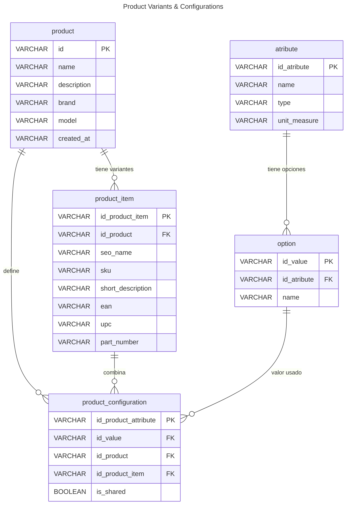

# Índice

-  Análisis de la funcionalidad de gestión de atributos/opciones de productos. 
-  Diagrama DER de configuración de atributos de productos.
-  Requerimientos de usuario para gestión de atributos de productos.  
-  Migraciones  necesarias para gestión de atributos variantes de productos. 

## Requerimiento:
-  Un producto puede tener variantes
-  Un producto debe atributos y valores configurables antes de poder asignar una variante.
-  Un producto puede variar por mas de un atributo
-  Un producto puede poder tener atributos compartidos con todas las variantes.
-  La configuración de atributos variantes de existir antes de que se agregue una variante para al producto. 
-  

## Ejemplo:
- *Producto*: 
	- Apple IPhone 14
- *Atributos con valores variantes*: 

| atributo       | valores posibles     |
| -------------- | -------------------- |
| Color          | Verde, Rojo, Negro   |
| Almacenamiento | 32 Gb, 64 Gb, 128 Gb |
| Memoria Ram    | 8 Gb, 16 Gb          |
- Atributos generales compartidos:

| Atributo | Valor      |
| -------- | ---------- |
| Pantalla | 4 Pulgadas |
| Wifi     | Si         |
| Antena   | 4G, 5G     |
### Ejemplo con variantes asignado a producto
Producto: Apple IPhone 14

| sku   | Variante                                                                                          |
| ----- | ------------------------------------------------------------------------------------------------- |
| 06645 | Apple IPhone 14, Verde, Almacenamiento 32 Gb, Ram 8Gb, Display 4 Pulgadas, Wifi, Antena 4G, 5G    |
| -     | Apple IPhone 14, Rojo, Almacenamiento 32 Gb, Ram 8Gb, Display 4 Pulgadas, Wifi, Antena 4G, 5G     |
| 02566 | Apple IPhone 14, Negro, Almacenamiento 128 Gb, Ram 16 Gb, Display 4 Pulgadas, Wifi, Antena 4G, 5G |
| 01256 | Apple IPhone 14, Verde, Almacenamiento 64 Gb, Ram 8 Gb, Display 4 Pulgadas, Wifi, Antena 4G, 5G   |
|       | .... Otras permutaciones de atributos variantes., Display 4 Pulgadas, Wifi, Antena 4G, 5G         |
## Diagrama DER

## Migraciones
Obs: ver que migraciones pueden hacer falta hacer.

-  Agregar product_id a la relacion product_configuration para relacionar producto con terminos de atributos.
-  Agregar campo is_shared como campo de control para atributos compartidos entre variantes de un producto. 

# Referencias
[[Implementacion Gestion de Atributos Variantes por Productos]]
