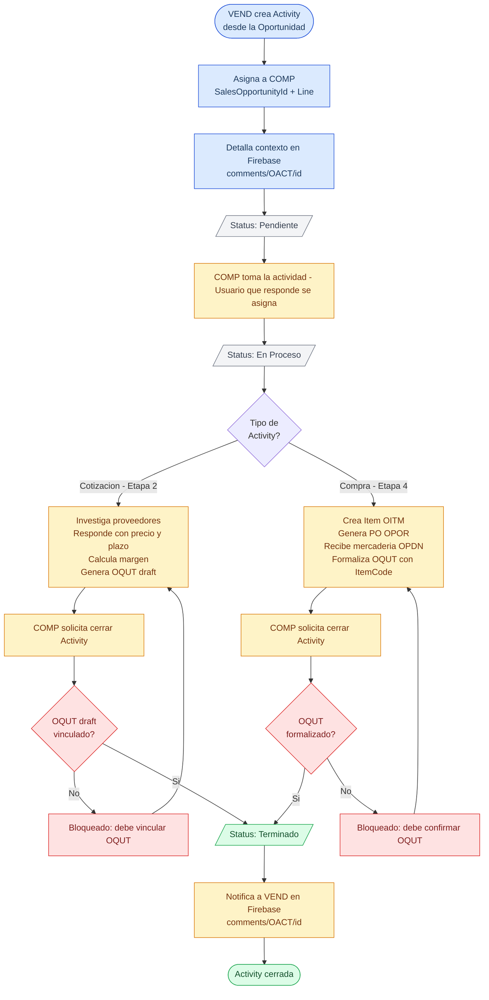
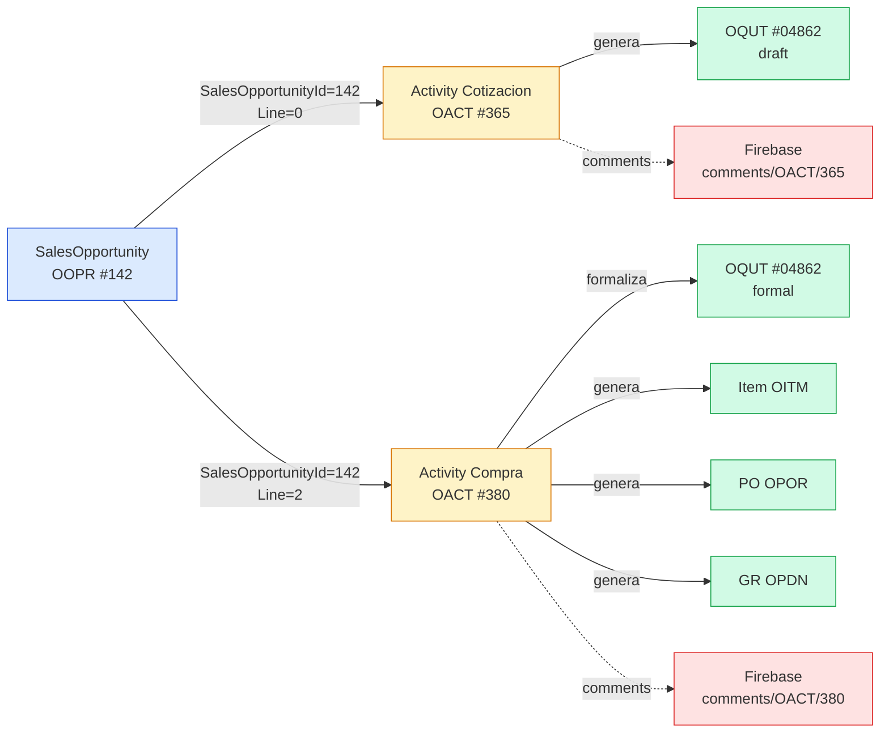

# Oportunidades de Venta — Documentación Funcional

> Documento consolidado de análisis y diseño del modulo de Oportunidades de Venta.
> Generado: febrero 2026
# Operativa de gestión de la oportunidad:
## etapas
1. Lead
2. Cotización (Negociación - B2C)
3. Oferta (Negociación - B2C)
4. Confirmado(Abastecimiento)
5. Cierre
## Definición de las etapas
1. **Lead:** en esta etapa se recibe un cliente potencial y se tiene prospecto de su interés por algún producto.
2. **Cotización:** cuando el producto de interés del cliente no existe para oferta, el vendedor pasa el interés del cliente al departamento de compras para saber de la disponibilidad de un producto. Potencialmente, el vendedor produce un documento en borrador de la cotización de oferta. Deberá producir el documento de cotización en draft para cerrar la actividad. 
3. **Oferta**: En esta etapa el Vendedor propone la cotización presentada por el departamento de ventas. en este paso puede retornar al anterior dependiendo de la respuesta del cliente. Ya existe un documento de cotización en draft. 
4. **Confirmado**: Esta etapa es de confirmación de la compra de parte del cliente. A esta etapa se pasa confirmando el draft de cotización que se pasara a compras. El vendedor solicita al departamento de compras el abastecimiento de el o los ítems de la Cotización aceptada por el cliente. En esta etapa compras crea productos si es necesario.  
5. **Cierre**: Fase final de determinación del estado de la oportunidad de venta. Si la oportunidad es ganada Confirma el documento de la cotización en un Pedido y cierra la oportunidad. Si la oportunidad es perdida, el vendedor reporta brevemente el motivo. 

## Condiciones de paso de etapas.

### Transiciones de etapa

Las etapas avanzan **automáticamente por evento**, no por accion manual del vendedor.

| #   | Transicion                              | Evento que la dispara                                                                                                                                      | Quien lo ejecuta                                                        |
| --- | --------------------------------------- | ---------------------------------------------------------------------------------------------------------------------------------------------------------- | ----------------------------------------------------------------------- |
| T1  | Lead (10%) → Cotizacion (30%)           | A - Vendedor envía primer mensaje en la oportunidad.<br>B - Vendedor crea una cotización. Donde el producto no existe, o no hay en stock. Le falta precio. | VEND (el sistema crea la Actividad de Cotización automáticamente)       |
| T2  | Cotizacion (30%) → Oferta (50%)         | Vendedor envía la oferta al cliente. Cotización en borrador propuesta por Compras.                                                                         | VEND (crea una cotización draft)<br>COMP (propone una cotización draft) |
| T3  | Oferta (50%) → Confirmado (80%)         | Vendedor registra que el cliente confirmo la compra. Posible Cotización Confirmada.                                                                        | VEND (accion explicita o confirmacion de cotizacion draft)              |
| T4  | Confirmado (80%) → Cierre Ganado (100%) | Cotización convertida a Orden de Venta                                                                                                                     | Sistema (al crear la Orden de Venta desde la Cotización)                |
| T5  | Cualquier etapa → Cierre Perdido (0%)   | Vendedor registra la oportunidad como perdida                                                                                                              | VEND (accion explicita, requiere motivo)                                |


---

### Convención de nombres

Este documento usa nombres del SAP B1 Service Layer en lugar de códigos de tabla.

| Entidad | Codigo SAP | Descripcion |
|---------|-----------|-------------|
| SalesOpportunity | OOPR | Oportunidad de venta (nodo central) |
| OpportunityLine | OOPR.Lines | Linea de etapa dentro de la oportunidad |
| Quotation | OQUT | Cotizacion al cliente |
| QuotationTextLine | OQUT.SpecialLines | Linea de texto libre (draft) |
| QuotationItemLine | OQUT.Lines | Linea con item real (formal) |
| SalesOrder | ORDR | Pedido de venta |
| Activity | OACT | Tarea, reunion, llamada |
| Item | OITM | Producto o servicio en catalogo |
| PurchaseOrder | OPOR | Orden de compra al proveedor |
| GoodsReceipt | OPDN | Recepcion de mercaderia |

---

## A1. Flujo principal

Ciclo de una oportunidad de venta en 5 etapas, desde apertura hasta cierre.

### Etapas

| # | Etapa | % Cierre | Trigger |
|---|-------|----------|---------|
| 1 | Lead | 10% | Alta de oportunidad |
| 2 | Cotizacion | 30% | VEND solicita disponibilidad/precio a COMP |
| 3 | Oferta | 50% | VEND envia cotizacion al cliente |
| 4 | Confirmado | 80% | Cliente acepta, VEND solicita abastecimiento |
| 5 | Cierre | 100%/0% | Quotation → SalesOrder (Won) o rechazo (Missed) |

### Pasos por etapa

#### Etapa 1: Lead

> Cliente potencial con interes en algun producto.

| #   | Actor | Accion                                 | Entidad                       | Resultado                           |
| --- | ----- | -------------------------------------- | ----------------------------- | ----------------------------------- |
| 1.1 | VEND  | Crea oportunidad                       | SalesOpportunity              | `Status=sos_Open`, `Stage=Lead`     |
| 1.2 | VEND  | Registra interes del cliente(opcional) | Firebase `comments/OOPR/{id}` | Contexto inicial                    |
| 1.3 | VEND  | Evalua disponibilidad                  | —                             | Disponible → Etapa 3 / No → Etapa 2 |

#### Etapa 2: Cotizacion

> Producto no disponible. VEND solicita a COMP investigar precio y disponibilidad.

| #   | Actor | Accion                            | Entidad                       | Resultado                           |
| --- | ----- | --------------------------------- | ----------------------------- | ----------------------------------- |
| 2.1 | VEND  | Solicita Activity de Cotizacion   | Activity                      | Solicitud a COMP                    |
| 2.2 | VEND  | Detalla specs y cantidad          | Firebase `comments/OACT/{id}` | Requerimientos del cliente          |
| 2.3 | COMP  | Investiga con proveedores         | (externo)                     | Precio costo, plazo, disponibilidad |
| 2.4 | COMP  | Responde con oferta interna       | Firebase `comments/OACT/{id}` | Precio + plazo                      |
| 2.5 | COMP  | Calcula precio de venta           | —                             | Aplica margen sobre costo           |
| 2.6 | COMP  | Genera Quotation draft(Opocional) | Quotation                     | Lineas `dslt_Text` (texto libre)    |

**Salida:** Quotation draft creado → Etapa 3. El item NO existe en SAP; el Quotation tiene lineas de texto con descripcion y precio.

#### Etapa 3: Oferta

> VEND presenta cotizacion al cliente. Negociación hasta decision.

| # | Actor | Accion | Resultado |
|---|-------|--------|-----------|
| 3.1 | VEND | Envia cotizacion al cliente | PDF en Firebase `comments/OQUT/{id}` |
| 3.2 | CLI | Revisa y responde | Feedback |
| 3.3 | VEND | Ajusta Quotation si hay cambios | Loop hasta decision |
| 3.4 | CLI | Comunica decision final | Acepta o rechaza |

**Salida:** Acepta + disponible → Etapa 5 (Won) / Acepta + requiere compra → Etapa 4 / Rechaza → Etapa 5 (Missed)

**Variante:** Si cambio requiere nueva consulta a COMP → retorna a Etapa 2

#### Etapa 4: Confirmado (Abastecimiento)

> Cliente confirmo. VEND solicita abastecimiento a COMP.

| #   | Actor | Accion                          | Entidad                       | Resultado                                                                                     |
| --- | ----- | ------------------------------- | ----------------------------- | --------------------------------------------------------------------------------------------- |
| 4.1 | VEND  | Solicita Activity de Compra     | Activity                      | Solicitud formal                                                                              |
| 4.2 | VEND  | Adjunta Quotation aceptado      | Firebase `comments/OACT/{id}` | Precio acordado                                                                               |
| 4.3 | COMP  | Crea item en SAP (si no existe) | Item                          | `ItemCode` + precio costo                                                                     |
| 4.4 | COMP  | Genera Orden de Compra          | PurchaseOrder                 | PO al proveedor                                                                               |
| 4.5 | COMP  | Recibe mercaderia(opcional)     | GoodsReceipt                  | Stock actualizado                                                                             |
| 4.6 | COMP  | Confirma Quotation              | Quotation                     | Reemplaza texto por `ItemCode` real y agrega estado de confirmado. Campo "Confirmed": "tYES", |
| 4.7 | COMP  | Notifica a VEND                 | Firebase `comments/OACT/{id}` | "Listo para cerrar"                                                                           |

**Salida:** Producto en stock, Quotation formalizado → Etapa 5 (Won)

#### Etapa 5: Cierre

| Resultado   | Actor | Accion                      | Entidad                                              |
| ----------- | ----- | --------------------------- | ---------------------------------------------------- |
| **Ganado**  | VEND  | Convierte Quotation a Order | Orders creado → `Status=sos_Won`                     |
| **Perdido** | VEND  | Registra motivo de rechazo  | `ReasonForClosing` obligatorio → `Status=sos_Missed` |

### Diagrama Mermaid

```mermaid
flowchart TD
    subgraph LEAD["1. Lead (10%)"]
        START([Inicio]) --> A1[VEND: Crea oportunidad<br/>OOPR Status=Open]
        A1 --> A2[VEND: Registra interes<br/>Firebase comments/OOPR]
        A2 --> CHECK{Producto disponible<br/>en SAP?}
    end

    subgraph COTIZACION["2. Cotizacion (30%)"]
        CHECK -->|No| TASK[VEND: Crea Actividad<br/>de Cotizacion OACT]
        TASK --> SPECS[VEND: Detalla specs<br/>Firebase comments/OACT]
        SPECS --> INVEST[COMP: Investiga<br/>con proveedores]
        INVEST --> OFFER[COMP: Responde con<br/>oferta interna]
        OFFER --> PRICE[COMP: Calcula precio<br/>de venta con margen]
        PRICE --> QUOT[COMP: Genera Quotation<br/>draft OQUT dslt_Text]
    end

    subgraph OFERTA["3. Oferta (50%)"]
        CHECK -->|Si| SEND
        QUOT --> SEND[VEND: Envia cotizacion<br/>al cliente]
        SEND --> CLI_REVIEW[CLI: Revisa cotizacion<br/>y responde]
        CLI_REVIEW --> CHANGES{Pide<br/>cambios?}
        CHANGES -->|Si| EDIT[VEND: Ajusta OQUT]
        EDIT -->|Nueva consulta COMP| TASK
        EDIT -->|Ajuste menor| SEND
        CHANGES -->|Decision final| DECISION{Cliente<br/>acepta?}
    end

    subgraph CONFIRMADO["4. Confirmado (80%)"]
        DECISION -->|Acepta + requiere compra| ACT_COMPRA[VEND: Crea Actividad<br/>de Compra OACT]
        ACT_COMPRA --> COMP_ITEM[COMP: Crea item<br/>en SAP OITM]
        COMP_ITEM --> COMP_PO[COMP: Genera Orden<br/>de Compra OPOR]
        COMP_PO --> COMP_REC[COMP: Recibe<br/>mercaderia OPDN]
        COMP_REC --> COMP_FORM[COMP: Formaliza OQUT<br/>ItemCode real]
        COMP_FORM --> COMP_NOT[COMP: Notifica a VEND<br/>Listo para cerrar]
    end

    subgraph CIERRE["5. Cierre"]
        DECISION -->|Acepta + disponible| CONVERT
        COMP_NOT --> CONVERT[VEND: Convierte<br/>OQUT a ORDR]
        CONVERT --> WON([Ganada<br/>sos_Won])

        DECISION -->|Rechaza| REASON[VEND: Registra<br/>ReasonForClosing]
        REASON --> LOST([Perdida<br/>sos_Missed])
    end

    %% Estilos
    classDef vendor fill:#dbeafe,stroke:#2563eb,color:#1e40af
    classDef compras fill:#fef3c7,stroke:#d97706,color:#92400e
    classDef cliente fill:#d1fae5,stroke:#059669,color:#065f46
    classDef decision fill:#fce7f3,stroke:#db2777,color:#9d174d
    classDef endpoint fill:#f3f4f6,stroke:#6b7280,color:#374151

    class A1,A2,TASK,SPECS,SEND,EDIT,ACT_COMPRA,CONVERT,REASON vendor
    class INVEST,OFFER,PRICE,QUOT,COMP_ITEM,COMP_PO,COMP_REC,COMP_FORM,COMP_NOT compras
    class CLI_REVIEW cliente
    class CHECK,CHANGES,DECISION decision
    class START,WON,LOST endpoint
```



### Leyenda

| Color    | Actor           | Responsabilidad                                                                        |
| -------- | --------------- | -------------------------------------------------------------------------------------- |
| Azul     | VEND (Vendedor) | Gestiona el ciclo de venta, presenta cotización al cliente                             |
| Amarillo | COMP (Compras)  | Investiga proveedores, calcula margenes/precio, genera Quotation draft, abastece items |
| Verde    | CLI (Cliente)   | Negocia y decide                                                                       |
| Rosa     | Decision        | Bifurcaciones del flujo                                                                |

### Version PlantUML

```plantuml
@startuml Flujo_Oportunidad_Venta

skinparam backgroundColor #FEFEFE
skinparam ActivityBackgroundColor #FFFFFF
skinparam ActivityBorderColor #64748B
skinparam ActivityDiamondBackgroundColor #FCE7F3
skinparam ActivityDiamondBorderColor #DB2777
skinparam ArrowColor #64748B

|#DBEAFE| VEND |
|#FEF3C7| COMP |
|#D1FAE5| CLI |

|VEND|
start

:**Etapa 1: Lead (10%)**; <<#E0E7FF>>

:Crea oportunidad
----
OOPR Status=Open, Stage=Lead
CardCode + MaxLocalTotal;

:Registra interes del cliente
----
Firebase comments/OOPR/{id};

:Evalua disponibilidad del producto;

if (Producto disponible en SAP?) then (Si)
else (No)

  :**Etapa 2: Cotizacion (30%)**; <<#FFF7ED>>

  :Crea Actividad de Cotizacion
  ----
  OACT Solicitud a Compras;

  :Detalla specs y cantidad
  ----
  Firebase comments/OACT/{id};

  |COMP|
  :Investiga con proveedores
  ----
  Precio costo, tiempo, disponibilidad;

  :Responde con oferta interna
  ----
  Precio + plazo estimado
  Firebase comments/OACT/{id};

  :Calcula precio de venta
  ----
  Aplica margen sobre costo;

  :Genera Quotation draft
  ----
  OQUT lineas dslt_Text
  (texto libre, item no existe en SAP);

  |VEND|

endif

:**Etapa 3: Oferta (50%)**; <<#EDE9FE>>

:Envia cotizacion al cliente
----
PDF opcional
Firebase comments/OQUT/{id};

|CLI|
:Revisa cotizacion y responde;

while (Pide cambios?) is (Si)
  |VEND|
  :Ajusta OQUT
  ----
  Si requiere nueva consulta
  a COMP retorna a Etapa 2;
  :Reenvia cotizacion;
  |CLI|
  :Revisa cotizacion y responde;
endwhile (Decision final)

if (Cliente acepta?) then (Acepta)

  |VEND|
  if (Requiere abastecimiento?) then (Si - no hay stock)

    :**Etapa 4: Confirmado (80%)**; <<#FEF3C7>>

    :Crea Actividad de Compra
    ----
    OACT Solicitud formal a Compras;

    :Adjunta OQUT aceptado
    ----
    Firebase comments/OACT/{id};

    |COMP|
    :Crea item en SAP
    ----
    OITM ItemCode + precio costo;

    :Genera Orden de Compra
    ----
    OPOR PO al proveedor;

    :Recibe mercaderia
    ----
    OPDN Stock actualizado;

    :Formaliza OQUT
    ----
    Reemplaza texto por ItemCode real;

    :Notifica a VEND
    ----
    Listo para cerrar
    Firebase comments/OACT/{id};

    |VEND|

  else (No - producto en stock)
  endif

  :**Etapa 5: Cierre Ganado (100%)**; <<#DCFCE7>>

  :Convierte OQUT a ORDR
  ----
  Pedido de venta creado;

  :Oportunidad **GANADA**
  ----
  OOPR Status = sos_Won; <<#90EE90>>
  stop

else (Rechaza)

  |VEND|

  :**Etapa 5: Cierre Perdido (0%)**; <<#FEE2E2>>

  :Registra motivo de rechazo
  ----
  OOPR ReasonForClosing (obligatorio);

  :Oportunidad **PERDIDA**
  ----
  OOPR Status = sos_Missed; <<#FFB6C1>>
  stop

endif

@enduml
```

Para visualizar: [PlantUML Online Server](https://www.plantuml.com/plantuml/uml/) o extension de VS Code.

---

## A2. Estados de SalesOpportunity

![[flujo operativo oportunidad.png]]
### Transiciones

| Desde      | Hacia        | Trigger                                             | Campos actualizados                       |
| ---------- | ------------ | --------------------------------------------------- | ----------------------------------------- |
| —          | Lead         | Alta de oportunidad                                 | `Status`, `CurrentStageNo`, `StartDate`   |
| Lead       | Cotizacion   | Producto no disponible, VEND solicita a COMP        | `CurrentStageNo`, `ClosingPercentage`     |
| Lead       | Oferta       | Producto disponible en stock                        | `CurrentStageNo`, `ClosingPercentage`     |
| Cotizacion | Oferta       | Quotation draft creado por COMP                     | `CurrentStageNo`, `ClosingPercentage`     |
| Oferta     | Cotizacion   | Cambio requiere nueva consulta a COMP               | `CurrentStageNo`, `ClosingPercentage`     |
| Oferta     | Confirmado   | Cliente acepta, requiere abastecimiento             | `CurrentStageNo`, `ClosingPercentage`     |
| Oferta     | `sos_Won`    | Cliente acepta + disponible, Quotation → SalesOrder | `Status`, `CloseDate`                     |
| Confirmado | `sos_Won`    | Abastecido, Quotation → SalesOrder                  | `Status`, `CloseDate`                     |
| Oferta     | `sos_Missed` | Cliente rechaza                                     | `Status`, `CloseDate`, `ReasonForClosing` |

### Porcentajes por etapa

| Etapa | StageKey | ClosingPercentage |
|-------|----------|-------------------|
| Lead | 1 | 10% |
| Cotizacion | 2 | 30% |
| Oferta | 3 | 50% |
| Confirmado | 4 | 80% |
| Cierre | 5 | 100% / 0% |

---

## A5. Reglas y restricciones

> Recopilacion de todas las reglas de negocio, validaciones y restricciones que gobiernan el ciclo de vida de la oportunidad de venta y sus entidades relacionadas.

---

### Transiciones de etapa

Las etapas avanzan **automaticamente por evento**, no por accion manual del vendedor.

| #    | Transicion                              | Evento que la dispara                                | Quien lo ejecuta                                                  |
| ---- | --------------------------------------- | ---------------------------------------------------- | ----------------------------------------------------------------- |
| T1   | Lead (10%) → Cotizacion (30%)           | Vendedor envia primer mensaje en la oportunidad      | VEND (el sistema crea la Actividad de Cotizacion automaticamente) |
| T1-A | Lead(10%) → Oferta(50%)                 | Vendedor registra cotización porque producto existe. |                                                                   |
| T2   | Cotizacion (30%) → Oferta (50%)         | Vendedor envia la oferta al cliente                  | VEND (accion explicita)                                           |
| T3   | Oferta (50%) → Confirmado (80%)         | Vendedor registra que el cliente confirmo la compra  | VEND (accion explicita)                                           |
| T4   | Confirmado (80%) → Cierre Ganado (100%) | Cotizacion convertida a Orden de Venta               | Sistema (al crear la Orden de Venta desde la Cotizacion)          |
| T5   | Cualquier etapa → Cierre Perdido (0%)   | Vendedor registra la oportunidad como perdida        | VEND (accion explicita, requiere motivo)                          |

**Restricciones de transición:**

- Se puede saltar etapas — el flujo es secuencial
- No se puede retroceder de etapa — si hay cambios se manejan con nuevas actividades dentro de la misma etapa
- Cierre Perdido requiere motivo obligatorio (campo `ReasonForClosing` en SAP)
- Cierre Ganado requiere que exista una Orden de Venta generada desde la Cotización

**Condiciones para el documento de Cotización:
- El documento en draft se utiliza en la etapa de cotización y oferta. 
- El vendedor confirma la cotización para solicitar la compra.
- En compra confirma la cotización en el proceso de compra o confirmación(cuando hay cambio de precio) para que el vendedor pueda pasar la Cotizacion a Pedido y cerrar la oportunidad como ganada. 


---

### Actividades

**Creacion:**

| #   | Regla                                                                                                                                     |
| --- | ----------------------------------------------------------------------------------------------------------------------------------------- |
| A1  | **Actividad de Cotizacion se crea automaticamente** cuando el vendedor envia un mensaje y no existe actividad abierta para la oportunidad |
| A2  | **Actividad de Compra se crea explicitamente** mediante el boton "Solicitar abastecimiento" que aparece al llegar a la etapa Confirmado   |
| A3  | El campo Subject se define automaticamente en la creacion: valor fijo "Cotizacion" o "Compra". No es editable por el usuario              |
| A4  | No puede haber dos actividades del mismo tipo abiertas simultaneamente para la misma oportunidad                                          |

**Cierre:**

| #   | Regla                                                                                                                                                            |
| --- | ---------------------------------------------------------------------------------------------------------------------------------------------------------------- |
| A5  | Solo COMP puede cerrar la actividad (cierre manual)                                                                                                              |
| A6  | **Validacion de cierre para Cotizacion:** debe existir una Cotizacion en borrador vinculada a la oportunidad                                                     |
| A7  | **Validacion de cierre para Compra:** debe existir una Cotizacion formalizada con items reales (no lineas de texto)                                              |
| A8  | Si despues de cerrar una actividad el vendedor necesita comunicarse de nuevo con Compras, se crea una nueva actividad. La anterior queda como registro historico |
| A9  | El estado "En Proceso" es logico (modelado en la UI). SAP solo tiene `open` y `closed`                                                                           |

---

### Cotizacion (Quotation)

| # | Regla |
|---|-------|
| Q1 | La Cotizacion en borrador usa lineas de texto especiales (`DocumentSpecialLines`). Los items no existen como productos en SAP |
| Q2 | COMP es quien genera la Cotizacion en borrador — calcula margenes, investiga proveedores, define precios |
| Q3 | El vendedor no modifica precios directamente. COMP debe aprobar cualquier cambio de precio durante la negociacion |
| Q4 | La Cotizacion se formaliza en la etapa Confirmado: COMP reemplaza las lineas de texto con items reales de SAP |
| Q5 | La formalizacion requiere que los items existan en el maestro de productos de SAP. Si no existen, COMP los crea |
| Q6 | Solo una Cotizacion activa por oportunidad a la vez. Las versiones anteriores quedan como historico |

---

### Orden de Venta

| #   | Regla                                                                                      |
| --- | ------------------------------------------------------------------------------------------ |
| O1  | La Orden de Venta se genera exclusivamente por conversion desde una Cotizacion formalizada |
| O2  | No se puede crear una Orden de Venta manualmente desde la oportunidad                      |
| O3  | Al generar la Orden de Venta, la oportunidad avanza automaticamente a Cierre Ganado (100%) |

---

### Abastecimiento

| #   | Regla                                                                                                                                                         |
| --- | ------------------------------------------------------------------------------------------------------------------------------------------------------------- |
| AB1 | El abastecimiento es opcional. Si los productos ya estan en stock, el vendedor puede indicar "No requiere" y avanzar directamente a generar la Orden de Venta |
| AB2 | Si se solicita abastecimiento, se crea una Actividad de Compra y COMP gestiona la Orden de Compra y Recepcion de Mercaderia                                   |
| AB3 | La Recepcion de Mercaderia es prerequisito para que COMP pueda formalizar la Cotizacion con items reales                                                      |

---

### Conversacion

| # | Regla |
|---|-------|
| CV1 | Los mensajes entre vendedor y Compras se almacenan en el contexto de la Actividad, no de la Oportunidad |
| CV2 | Los mensajes entre vendedor y cliente se almacenan en el contexto de la Cotizacion |
| CV3 | La vista de la oportunidad agrega los mensajes de todas las Actividades hijas en un timeline unificado |
| CV4 | Las notas del vendedor (no conversacion) se almacenan en el contexto de la Oportunidad |
| CV5 | Cuando el vendedor escribe un mensaje y no hay Actividad abierta, el sistema crea una automaticamente antes de enviar el mensaje |

---

### Permisos por actor

| Accion | VEND | COMP | GER |
|--------|------|------|-----|
| Crear oportunidad | Si | No | No |
| Escribir mensajes en oportunidad | Si | No | No |
| Responder mensajes en actividad | No | Si | No |
| Cerrar actividad | No | Si | No |
| Generar Cotizacion en borrador | No | Si | No |
| Formalizar Cotizacion | No | Si | No |
| Enviar oferta al cliente | Si | No | No |
| Registrar confirmacion del cliente | Si | No | No |
| Solicitar abastecimiento | Si | No | No |
| Indicar "No requiere abastecimiento" | Si | No | No |
| Registrar como perdida | Si | No | Si |
| Convertir Cotizacion a Orden de Venta | Si | No | No |
| Ver pipeline | Si | Si | Si |
| Ver detalle de oportunidad | Si | Si | Si |

---

## Bloque B — Activity

---

### B1. Flujo de Activity

VEND crea y asigna la Activity; COMP ejecuta, completa el trabajo, y cierra con validacion.



#### Validaciones de cierre

| Tipo | Condicion para cerrar | Que se valida |
|------|----------------------|---------------|
| **Cotizacion** | Quotation draft vinculado | Existe Quotation con `SalesOpportunityId` en las lineas de la oportunidad |
| **Compra** | Quotation formalizado | El Quotation tiene `DocumentLines` con `ItemCode` (no solo texto) |

> **Re-negociacion:** Si despues de cerrar una Activity de Cotizacion el cliente pide cambios que afectan precio, se crea una **nueva** Activity. La anterior queda como registro historico.

---

### B2. Estados de Activity

```mermaid
stateDiagram-v2
    direction LR

    [*] --> Pendiente : VEND crea Activity\ndesde la oportunidad

    Pendiente --> EnProceso : COMP toma la actividad(Autoasinacion)

    EnProceso --> EnProceso : Trabajo en curso\n(investiga, compra, etc.)
    EnProceso --> Terminado : COMP cierra\n(validacion OK)

    Terminado --> [*]

    state Pendiente {
        direction LR
        [*] --> EsperandoCOMP
        EsperandoCOMP : Activity creada
        EsperandoCOMP : Contexto en Firebase
    }

    state EnProceso {
        direction LR
        [*] --> Trabajando
        Trabajando : COMP ejecuta segun tipo
        Trabajando --> Comunicando : Avance/resultado
        Comunicando : Firebase comments/OACT/id
        Comunicando : Alta de Draft de Quotation
        Comunicando --> Trabajando : Mas trabajo pendiente
        Comunicando --> ValidandoCierre : Solicita cerrar
        ValidandoCierre --> Trabajando : Validacion falla
    }

    state Terminado {
        direction LR
        [*] --> Cerrado
        Cerrado : Resultado entregado
        Cerrado : Notificacion a VEND
    }
```



#### Transiciones

| Estado origen | Trigger | Estado destino | Quien | Condicion |
|---------------|---------|----------------|-------|-----------|
| — | VEND crea Activity con SalesOpportunityId | Pendiente | VEND | Oportunidad en etapa correcta |
| Pendiente | COMP toma la actividad | En Proceso | COMP | `HandledBy` = usuario actual |
| En Proceso | COMP solicita cerrar | Terminado | COMP | Validacion de cierre OK |
| En Proceso | Trabajo continua | En Proceso | COMP | Self-loop |

> Una Activity cerrada no se reabre. Si se necesita retomar trabajo, se crea una nueva.

---

### B3. Tipos de Activity

| Aspecto                  | Cotizacion (Etapa 2)                 | Compra (Etapa 4)                                         |
| ------------------------ | ------------------------------------ | -------------------------------------------------------- |
| **ActivityType SAP**     | `task`                               | `task`                                                   |
| **Creada por**           | VEND                                 | VEND                                                     |
| **Ejecutada por**        | COMP                                 | COMP                                                     |
| **Proposito**            | Obtener precio/disponibilidad        | Abastecer producto y formalizar Quotation                |
| **Input de VEND**        | Specs, cantidades, requerimientos    | Quotation aceptado por cliente                           |
| **Output de COMP**       | Quotation draft (lineas `dslt_Text`) | Quotation formalizado (lineas con `ItemCode`)            |
| **Entidades generadas**  | Quotation (draft)                    | Item + PurchaseOrder + GoodsReceipt + Quotation (formal) |
| **Validacion de cierre** | Quotation draft vinculado            | Quotation formalizado con items                          |

#### Otros tipos (fuera del flujo principal)

| ActivityType | Uso tipico | Quien crea |
|--------------|-----------|------------|
| `meeting` | Reunion con cliente | VEND |
| `call` | Llamada telefonica | VEND |
| `email` | Correo electronico | VEND |

> Estos tipos no tienen validacion de cierre especial. Son registros informativos en el timeline.

---

### B4. Vinculo Activity — SalesOpportunity

#### Campos de vinculación

| Campo                  | Tipo     | Obligatorio | Descripción                                                                |
| ---------------------- | -------- | ----------- | -------------------------------------------------------------------------- |
| `SalesOpportunityId`   | int (FK) | **Si**      | ID de la oportunidad. Sin este campo la Activity NO aparece en el timeline |
| `SalesOpportunityLine` | int      | Recomendado | Linea de etapa. Ubica la Activity en la etapa correcta                     |
| `HandledBy`            | int (FK) | Si          | Empleado asignado. Para Cotizacion y Compra siempre es COMP                |

#### Reglas de vinculación

1. Toda Activity del flujo debe crearse desde la oportunidad. El sistema setea `SalesOpportunityId` automaticamente.
2. `SalesOpportunityLine` apunta a la linea de etapa activa al crear.
3. Relacion N:1 — una Activity pertenece a una sola oportunidad.
4. El vinculo es inmutable — `SalesOpportunityId` no se modifica post-creacion.

#### Snippet de creacion (Service Layer)

```json
{
  "ActivityCode": -1,
  "ActivityType": "cn_TaskNote",
  "SalesOpportunityId": 142,
  "SalesOpportunityLine": 1,
  "HandledBy": 115,
  "ActivityDate": "2026-02-26",
  "StartTime": "09:00:00",
  "Status": "open",
  "Notes": "Solicitud de cotizacion - ver comentarios en Firebase"
}
```

> En SAP B1, `ActivityType` usa constantes: `cn_TaskNote` (task), `cn_Meeting` (meeting), `cn_PhoneCall` (call).

#### Diagrama de vinculacion


